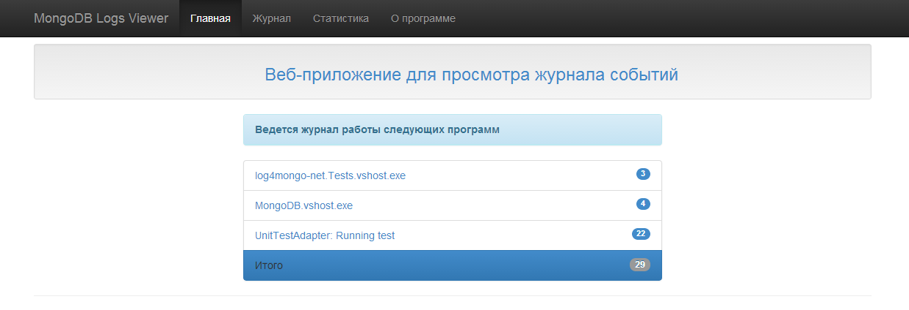
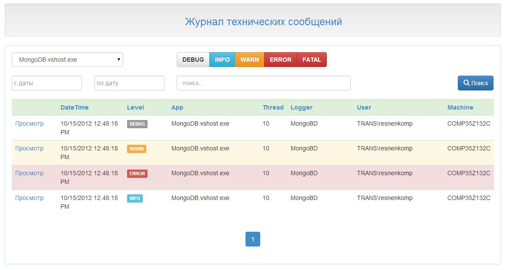
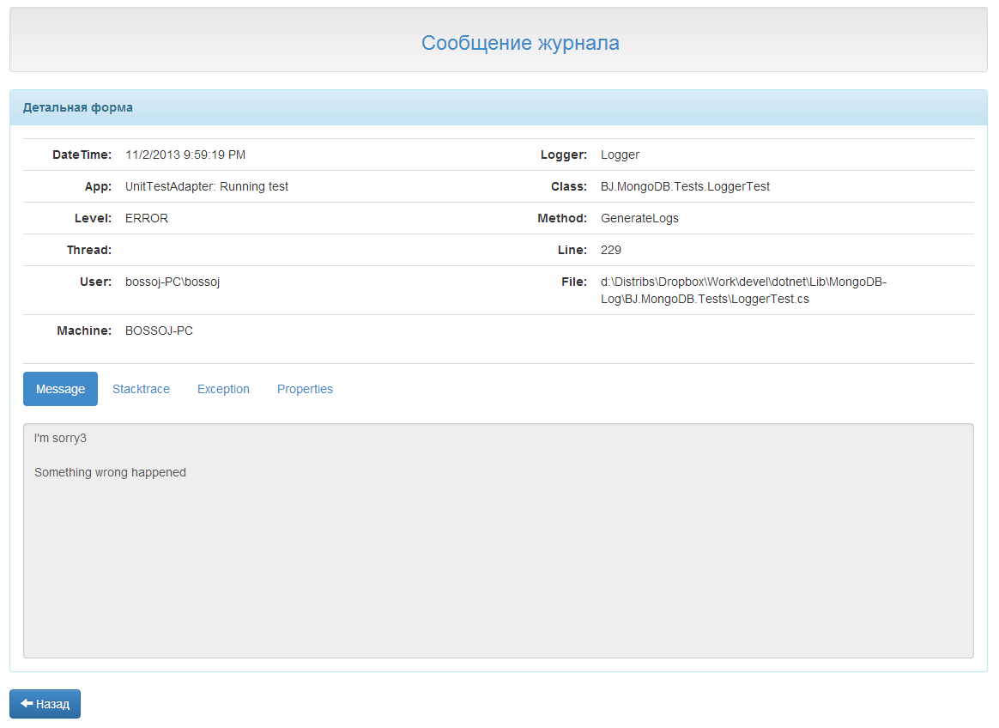
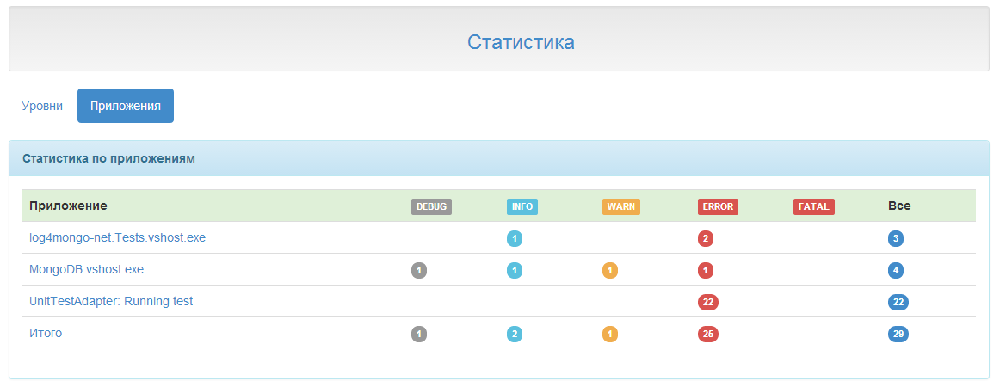
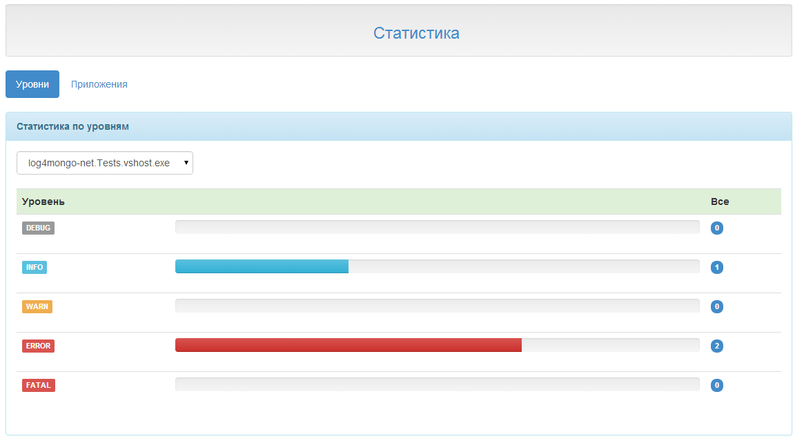

MongoDB-Log
===========
Simple library .NET for read/write logs to the MongoDB, and viewer client(WinForms, Web).

Support formats log item [log4mongo-net](http://github.com/log4mongo/log4mongo-net).

Check [Log4Net site](http://logging.apache.org/log4net/) or [MongoDB site](http://www.mongodb.org/) if you need more info.

Sample
------------
See here [MongoLog](http://185.41.187.23/MongoLog) 

Installation
------------
Download sources.

License
------------
[Apache License, Version 2.0](http://www.apache.org/licenses/LICENSE-2.0)

Screen Shots
------------

####Main

####Logs

####Details

####Statistic apps

####Statistic level

